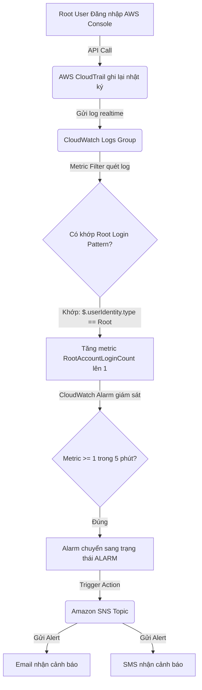
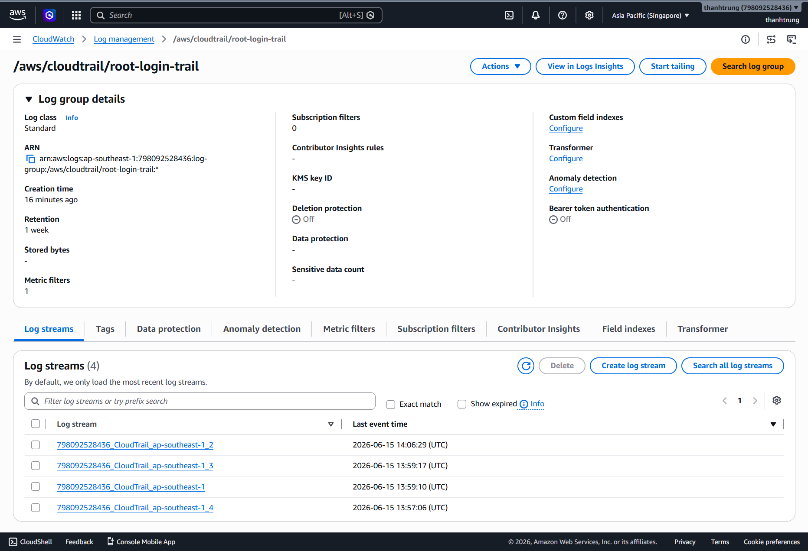
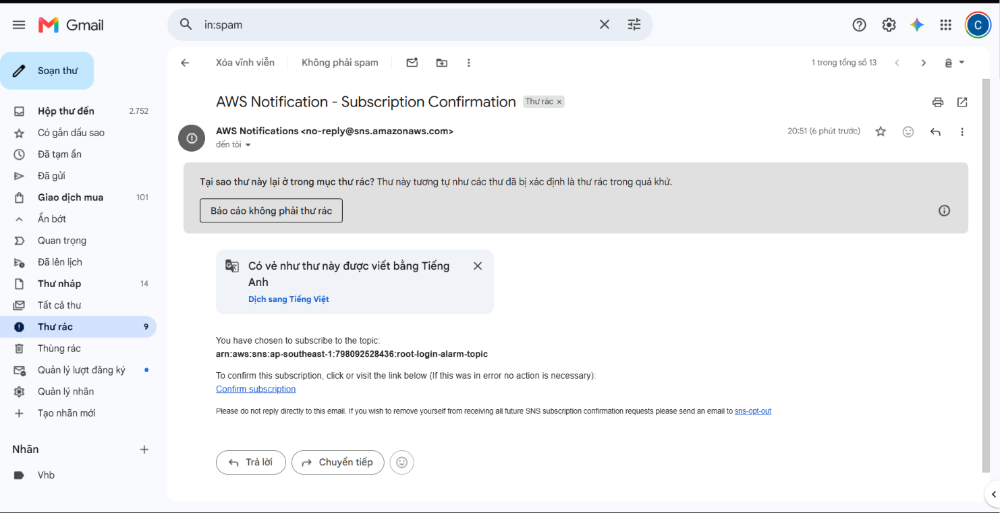
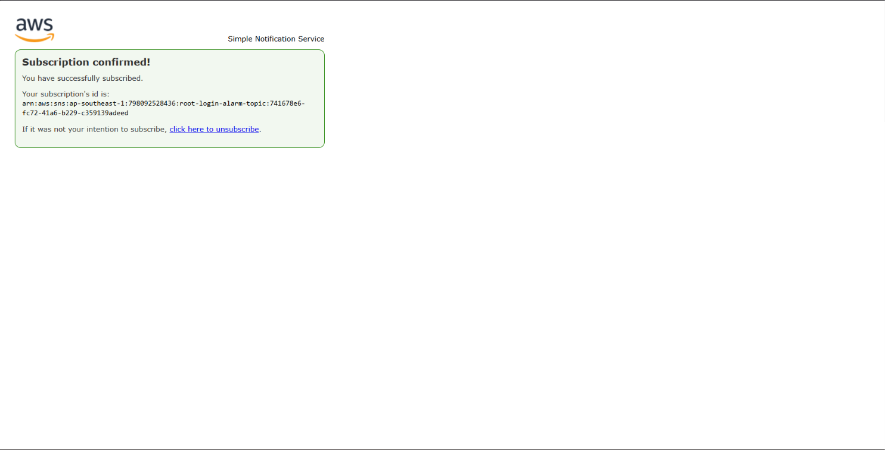

# BÁO CÁO MINH CHỨNG THỰC HÀNH (LAB EVIDENCE)

## 👤 Thông tin học viên
* **Họ và tên:** [Điền họ tên của bạn]
* **Mã học viên:** [Điền mã học viên]
* **Lớp:** [Điền tên lớp/khóa học]
* **Bài tập:** Bài tập 3 - Thiết lập cảnh báo đăng nhập AWS Root Account

---

## 📖 Giải thích yêu cầu bài tập (Lab Concept & Objective)

### 1. Bài tập này yêu cầu bạn làm gì?
Bài tập này yêu cầu bạn thiết lập một hệ thống **giám sát tự động (Monitoring & Alerting)** để gửi cảnh báo ngay lập tức qua **Email/SMS** khi có bất kỳ ai đăng nhập vào tài khoản **AWS Root Account** (tài khoản gốc của AWS).

### 2. Tại sao việc này quan trọng?
* **Security Best Practice (Nguyên tắc bảo mật tốt nhất):** Tài khoản Root có quyền tối cao và không bị giới hạn trên AWS. Nếu tài khoản này bị lộ thông tin, kẻ tấn công có thể xóa toàn bộ dữ liệu, phá hủy hạ tầng hoặc chạy các tài nguyên đào tiền ảo gây thiệt hại chi phí khổng lồ. 
* Do đó, AWS khuyến cáo **hầu như không bao giờ được sử dụng tài khoản Root** trong công việc hàng ngày mà nên dùng các tài khoản IAM với quyền hạn tối thiểu (Least Privilege).
* Nếu có bất kỳ hoạt động đăng nhập Root nào xảy ra, hệ thống phải phát hiện và **báo động (Alert) ngay lập tức** cho đội ngũ bảo mật (Security Team).

### 3. Luồng hoạt động của hệ thống (Workflow):

---

## 📸 Hình ảnh minh chứng cần chụp (Screenshots Checklist)

Dưới đây là danh sách các hình ảnh bạn cần chụp từ trang AWS Console của mình sau khi chạy lệnh `terraform apply` để hoàn thành báo cáo bài tập.

### 🖼️ Minh chứng 1: CloudTrail Logs Group & Trail hoạt động
* **Cách chụp:** Vào **AWS CloudTrail** -> **Trails** hoặc **CloudWatch** -> **Log groups** -> Tìm Log Group `/aws/cloudtrail/root-login-trail`.
* **Mục tiêu:** Cho thấy log group đã được tạo và đang nhận log từ CloudTrail.
* 

---

### 🖼️ Minh chứng 2: Cấu hình Metric Filter trong CloudWatch Logs Group
* **Cách chụp:** Vào **CloudWatch** -> **Log groups** -> Chọn `/aws/cloudtrail/root-login-trail` -> Chọn tab **Metric filters**.
* **Mục tiêu:** Hiển thị Metric Filter mang tên `RootAccountLoginMetricFilter` với Pattern:
  `{ $.userIdentity.type = "Root" && $.eventType != "AwsServiceEvent" }`
* *[Chèn ảnh chụp màn hình Metric Filter tại đây]*

---

### 🖼️ Minh chứng 3: Cấu hình CloudWatch Alarm
* **Cách chụp:** Vào **CloudWatch** -> **Alarms** -> Chọn Alarm `RootAccountLoginAlarm`.
* **Mục tiêu:** Hiển thị đồ thị của alarm, ngưỡng `RootAccountLoginCount >= 1`, trạng thái hiện tại (OK hoặc INSUFFICIENT DATA) và Action liên kết tới SNS topic.
* *[Chèn ảnh chụp màn hình trang thông tin chi tiết Alarm tại đây]*

---

### 🖼️ Minh chứng 4: Email xác nhận (Subscription Confirmed) từ SNS
* **Cách chụp:** Mở hộp thư Gmail/Email của bạn, tìm thư xác nhận của AWS SNS.
* **Mục tiêu:** Cho thấy bạn đã đăng ký thành công email và trạng thái SNS Subscription là `Confirmed`.
* 
* 

---

### 🖼️ Minh chứng 5: Email cảnh báo đăng nhập thực tế (Triggered Alarm) - *Điểm cộng*
* **Cách kiểm tra:** Đăng xuất IAM, đăng nhập lại bằng Root User của tài khoản AWS đó. Chờ 3-5 phút.
* **Mục tiêu:** Chụp lại email cảnh báo có tiêu đề `ALARM: "RootAccountLoginAlarm" in ap-southeast-1` do AWS tự động gửi về.
* *[Chèn ảnh chụp màn hình Email cảnh báo thực tế tại đây]*
